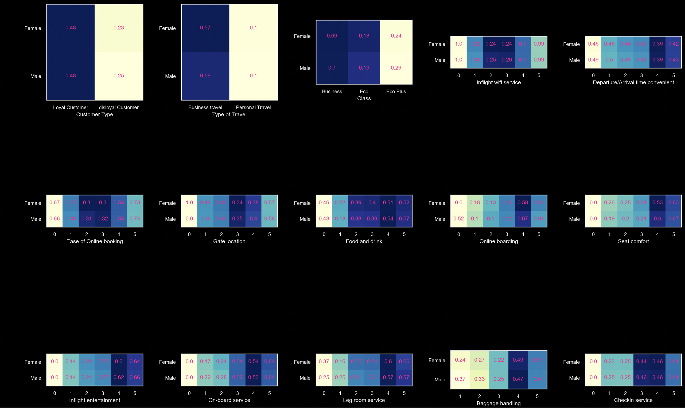

# 🛩️ Airline Satisfaction Predictors 🚁
<p align='justify'>
The airline industry is undeniably massive with an annual revenue exceeding $800B and 6M travelers per day. A team of four computer engineers from Cairo university have taken it upon themselves to find out a recipe for the perfect airline company by answering the paramount question <i>“What makes airline customers satisfied?”</i>. The question is posed as both a data analysis problem and a machine learning problem that together answer it via exploratory analytics, association rule mining and predictive models.
</p>

## 🚀 Pipeline
Our approach to said problem utilized the following pipeline


## 📂 Folder Structure
The following is the implied folder structure:
```
.
├── DataFiles
│ ├── airline-train.csv
│ └── airline-val.csv
├── DataPreparation
│ ├── DataPreparation.py
│ └── Visualization.ipynb
└── ModelPipelines
├── Apriori
│ ├── Apriori.ipynb
│ └── rules.txt
├── NaiveBayes
│ ├── NaiveBayes.ipynb
│ └── NaiveBayes.py
├── RandomForest
│ ├── RandomForest.ipynb
│ └── RandomForest.py
└── SVC
├── SVC.ipynb
└── SVC.py
```


## 🚡 Running the Project

```python
pip install requirements.txt
# To run any stage of the pipeline, consider the stage's folder. There will always be a demonstration notebook.
```
We have also run the project on the cloud via Azure ML studio. You may contact the developers if you find any issue in that.

## 🛫 Data Preparation

We used [Kaggle's](https://www.kaggle.com/datasets/teejmahal20/airline-passenger-satisfaction?select=train.csv) Airline satisfaction dataset as shown below

<table border="0" class="dataframe">
  <thead>
    <tr style="text-align: center;">
      <th></th>
      <th>Age</th>
      <th>Flight Distance</th>
      <th>Departure Delay in Minutes</th>
      <th>Arrival Delay in Minutes</th>
      <th>Gender</th>
      <th>Customer Type</th>
      <th>Type of Travel</th>
      <th>Class</th>
      <th>Inflight wifi service</th>
      <th>Departure/Arrival time convenient</th>
      <th>Ease of Online booking</th>
      <th>Gate location</th>
      <th>Food and drink</th>
      <th>Online boarding</th>
      <th>Seat comfort</th>
      <th>Inflight entertainment</th>
      <th>On-board service</th>
      <th>Leg room service</th>
      <th>Baggage handling</th>
      <th>Checkin service</th>
      <th>Inflight service</th>
      <th>Cleanliness</th>
    </tr>
  </thead>
  <tbody>
    <tr>
      <th>0</th>
      <td>13</td>
      <td>460</td>
      <td>25</td>
      <td>18.0</td>
      <td>Male</td>
      <td>Loyal Customer</td>
      <td>Personal Travel</td>
      <td>Eco Plus</td>
      <td>3</td>
      <td>4</td>
      <td>3</td>
      <td>1</td>
      <td>5</td>
      <td>3</td>
      <td>5</td>
      <td>5</td>
      <td>4</td>
      <td>3</td>
      <td>4</td>
      <td>4</td>
      <td>5</td>
      <td>5</td>
    </tr>
    <tr>
      <th>1</th>
      <td>25</td>
      <td>235</td>
      <td>1</td>
      <td>6.0</td>
      <td>Male</td>
      <td>disloyal Customer</td>
      <td>Business travel</td>
      <td>Business</td>
      <td>3</td>
      <td>2</td>
      <td>3</td>
      <td>3</td>
      <td>1</td>
      <td>3</td>
      <td>1</td>
      <td>1</td>
      <td>1</td>
      <td>5</td>
      <td>3</td>
      <td>1</td>
      <td>4</td>
      <td>1</td>
    </tr>
    <tr>
      <th>2</th>
      <td>26</td>
      <td>1142</td>
      <td>0</td>
      <td>0.0</td>
      <td>Female</td>
      <td>Loyal Customer</td>
      <td>Business travel</td>
      <td>Business</td>
      <td>2</td>
      <td>2</td>
      <td>2</td>
      <td>2</td>
      <td>5</td>
      <td>5</td>
      <td>5</td>
      <td>5</td>
      <td>4</td>
      <td>3</td>
      <td>4</td>
      <td>4</td>
      <td>4</td>
      <td>5</td>
    </tr>
  </tbody>
</table>

Our data preparation module was implemented using Pandas and PySpark and supports the following:
- Reading a specific split of the data (training or validation)
- Reading specific column types from the data (numerical, ordinal or categorical)
- Frequency Encoding for categorical features
- Dropping missing values
- Imputing numerical outliers
Alternatives for the function were implemented as well in case any model required further special preprocessing.

## 🎨 Exploratory Data Analytics

Instead of querying the dataset for specific facts, we priotized that it should tell us all the facts. In other words, we have let the data speak for itself and for that we designed the following analysis workflow

<table>
  
  <tr>
    <th>Analysis Stage</th>
    <th>Components</th>
  </tr>
  <tr>
    <td rowspan="6">Univariate Analysis</td>
    <td >Prior Class Distribution</td>
  </tr>
  <tr>
    <td>Basics Features Involved </td>
  </tr>
    <tr>
    <td> Missing Data Analysis </td>
  </tr>
    <tr>
    <td>Central Tendency & Spread </td>
  </tr>
    <tr>
    <td>Feature Distirbutions </td>
  </tr>
    <tr>
    <td> Feature Distributions per Class </td>
  </tr>

  <tr>
    <td rowspan="5">Correlations & Associations</td>
    <td>Dependence between Categorical Features</td>
  </tr>
  <tr>
    <td> Correlations between Categorical & Numerical Features </td>
  </tr>
  <tr>
    <td> Monotonic Association between Ordinal Variables</td>
  </tr>
  <tr>
    <td>Correlations between Numerical Features</td>
  </tr>
  <tr>
    <td>Naive Bayes Assumption</td>
  </tr>
  
  <tr>
    <td rowspan="5">Multivariate Analysis</td>
    <td>Separability & Distribution of Numerical Features</td>
  </tr>
  <tr>
    <td>Separability & Distribution of Numerical Feature Pairs </td>
  </tr>
  <tr>
    <td>Separability & Distribution of Numerical Feature Trios </td>
  </tr>

  <tr>
    <td>Seprability and Distribution of Numerical and Categorical Pairs</td>
  </tr>
    <tr>
    <td>Seprability and Distribution of Categorical Pairs</td>
  </tr>
  
</table>

In the following we will take you through a cursory glance of the workflow, the set of insights that each visual corresponds to (over 50 insights in total) can be found in the demonstration notebook or the [report](https://github.com/NouranHany/Big-data-project/tree/main/Report.pdf/) along with full versions of the visuals and tables.

### 🪂 Univariate Analysis
#### ◉ Prior Class Distribution
In this we study if there is any imbalance among the satisfaction levels of people involved in the dataset.


#### ◉ Basics of Each Feature
This provides a description, type and possible values for each feature.


| Variable Name                       | Variable Description                                              | Variable Type | Values                                                  |
| ----------------------------------- | ---------------------------------------------------------------- | -------------- | ------------------------------------------------------- |
| Gender                              | Gender of the passengers                                         | Nominal        | Female, Male                                            |
| Customer Type                       | The customer type                                                | Nominal        | Loyal customer, Disloyal customer                       |
| Age                                 | The actual age of the passengers                                | Numerical      | -                                                       |
| Type of Travel                      | Purpose of the flight of the passengers                         | Nominal        | Personal Travel, Business Travel                       |
| Class                               | Travel class in the plane of the passengers                     | Nominal        | Business, Eco, Eco Plus                                |
| Flight Distance                     | The flight distance of this journey                             | Numerical      | -                                                       |
| Inflight wifi service               | Satisfaction level of the inflight wifi service                 | Ordinal        | 1, 2, 3, 4, 5                                          |
| Departure/Arrival time convenient   | Satisfaction level of Departure/Arrival time convenient         | Ordinal        | 1, 2, 3, 4, 5                                          |
| Ease of Online booking              | Satisfaction level of online booking                            | Ordinal        | 1, 2, 3, 4, 5                                          |
| Gate location                       | Satisfaction level of Gate location                             | Ordinal        | 1, 2, 3, 4, 5                                          |
| Food and drink                      | Satisfaction level of Food and drink                            | Ordinal        | 1, 2, 3, 4, 5                                          |
| Online boarding                     | Satisfaction level of online boarding                           | Ordinal        | 1, 2, 3, 4, 5                                          |
| Seat comfort                        | Satisfaction level of Seat comfort                             | Ordinal        | 1, 2, 3, 4, 5                                          |
| Inflight entertainment              | Satisfaction level of inflight entertainment                    | Ordinal        | 1, 2, 3, 4, 5                                          |
| On-board service                    | Satisfaction level of On-board service                         | Ordinal        | 1, 2, 3, 4, 5                                          |
| Leg room service                    | Satisfaction level of Leg room service                         | Ordinal        | 1, 2, 3, 4, 5                                          |
| Baggage handling                    | Satisfaction level of baggage handling                         | Ordinal        | 1, 2, 3, 4, 5                                          |
| Check-in service                    | Satisfaction level of Check-in service                         | Ordinal        | 1, 2, 3, 4, 5                                          |
| Inflight service                    | Satisfaction level of inflight service                         | Ordinal        | 1, 2, 3, 4, 5                                          |
| Cleanliness                         | Satisfaction level of Cleanliness                              | Ordinal        | 1, 2, 3, 4, 5                                          |
| Departure Delay in Minutes          | Minutes delayed when departure                                 | Numerical      | -                                                       |
| Arrival Delay in Minutes            | Minutes delayed when Arrival                                   | Numerical      | -                                                       |
| Satisfaction                        | Airline satisfaction level                                     | Nominal        | Satisfaction, Neutral, Dissatisfaction                 |

#### ◉ Missing Data Analysis
In this, we analyze each feature for missing data.

<table border="0" class="dataframe">
  <thead>
    <tr style="text-align: right;">
      <th></th>
      <th>Age</th>
      <th>Flight Distance</th>
      <th>Departure Delay in Minutes</th>
      <th>Arrival Delay in Minutes</th>
      <th>Gender</th>
      <th>Customer Type</th>
      <th>Type of Travel</th>
      <th>Class</th>
      <th>Inflight wifi service</th>
      <th>Departure/Arrival time convenient</th>
      <th>Ease of Online booking</th>
      <th>Gate location</th>
      <th>Food and drink</th>
      <th>Online boarding</th>
      <th>Seat comfort</th>
      <th>Inflight entertainment</th>
      <th>On-board service</th>
      <th>Leg room service</th>
      <th>Baggage handling</th>
      <th>Checkin service</th>
      <th>Inflight service</th>
      <th>Cleanliness</th>
    </tr>
  </thead>
  <tbody>
    <tr>
      <th>Missing Count</th>
      <td>0</td>
      <td>0</td>
      <td>0</td>
      <td>310</td>
      <td>0</td>
      <td>0</td>
      <td>0</td>
      <td>0</td>
      <td>0</td>
      <td>0</td>
      <td>0</td>
      <td>0</td>
      <td>0</td>
      <td>0</td>
      <td>0</td>
      <td>0</td>
      <td>0</td>
      <td>0</td>
      <td>0</td>
      <td>0</td>
      <td>0</td>
      <td>0</td>
    </tr>
  </tbody>
</table>

#### ◉ Central Tendency and Spread
For each type of feature, we consider measures of central tendency and spread. This is an example for numerical features.

<table border="0" class="dataframe">
  <thead>
    <tr style="text-align: right;">
      <th></th>
      <th>Age</th>
      <th>Flight Distance</th>
      <th>Departure Delay in Minutes</th>
      <th>Arrival Delay in Minutes</th>
    </tr>
  </thead>
  <tbody>
    <tr>
      <th>count</th>
      <td>103904.000000</td>
      <td>103904.000000</td>
      <td>103904.000000</td>
      <td>103594.000000</td>
    </tr>
    <tr>
      <th>mean</th>
      <td>39.379706</td>
      <td>1189.448375</td>
      <td>14.815618</td>
      <td>15.178678</td>
    </tr>
    <tr>
      <th>std</th>
      <td>15.114964</td>
      <td>997.147281</td>
      <td>38.230901</td>
      <td>38.698682</td>
    </tr>
    <tr>
      <th>min</th>
      <td>7.000000</td>
      <td>31.000000</td>
      <td>0.000000</td>
      <td>0.000000</td>
    </tr>
    <tr>
      <th>25%</th>
      <td>27.000000</td>
      <td>414.000000</td>
      <td>0.000000</td>
      <td>0.000000</td>
    </tr>
    <tr>
      <th>50%</th>
      <td>40.000000</td>
      <td>843.000000</td>
      <td>0.000000</td>
      <td>0.000000</td>
    </tr>
    <tr>
      <th>75%</th>
      <td>51.000000</td>
      <td>1743.000000</td>
      <td>12.000000</td>
      <td>13.000000</td>
    </tr>
    <tr>
      <th>max</th>
      <td>85.000000</td>
      <td>4983.000000</td>
      <td>1592.000000</td>
      <td>1584.000000</td>
    </tr>
  </tbody>
</table>

#### ◉ Feature Distributions
Here we analyze the distributions of each feature to look for any special patterns.


#### ◉ Feature Distributions per Class
This provides the same analysis as above, but per class.


### 🪂🪂 Correlations

#### ◉ Dependence between Categorical Features

We have used the Chi-square test of independence which tests if there is a relationship between two categorical variables. In particular, we have that

$H_0$: The two categorical variables are independent.

$H_1$: The two categorical variables are dependent.

Here, we set $\alpha = 0.05$ and hence, if the p-value for the test done on two variables is less than $0.05$, we reject the null hypothesis and conclude that the two variables are dependent.

<table border="0" class="dataframe">
  <thead>
    <tr style="text-align: right;">
      <th></th>
      <th>Gender</th>
      <th>Customer Type</th>
      <th>Type of Travel</th>
      <th>Class</th>
    </tr>
  </thead>
  <tbody>
    <tr>
      <th>Gender</th>
      <td>0.0</td>
      <td>0.0</td>
      <td>0.026398</td>
      <td>0.000119</td>
    </tr>
    <tr>
      <th>Customer Type</th>
      <td>0.0</td>
      <td>0.0</td>
      <td>0.0</td>
      <td>0.0</td>
    </tr>
    <tr>
      <th>Type of Travel</th>
      <td>0.026398</td>
      <td>0.0</td>
      <td>0.0</td>
      <td>0.0</td>
    </tr>
    <tr>
      <th>Class</th>
      <td>0.000119</td>
      <td>0.0</td>
      <td>0.0</td>
      <td>0.0</td>
    </tr>
  </tbody>
</table>


#### ◉ Associationss between Categorical & Numerical Features
We have used Pearson's correlation ratio to find associations between all possible numerical and categorical features


#### ◉ Monotonic Association between Ordinal Variables
We have use Spearman's to find monotonic associations between ordinal variables


####  ◉ Correlations between Numerical Features
We have use Pearson's to study linear correlation between numerical variables


#### ◉ Naive Bayes Assumption
Related to dependence is also testing the Naive bayes assumption. We hae provided an automated way for that with the sample output:

<font size=4> As expected, the Naive Bayes assumption does not hold. In particular, we have that
                    $$P(x_1, x_2, ...|C_1=0)=0.16$$ 
                    as computed numerically using the definition of the probability.
                    Meanwhile, applying the Naive Bayes assumption we have that
                    $$P(x_1, x_2, ...|C_1=0)=P(x_1|C_1=0)P(x_2|C_1=0)...=0.08$$ 
                    which is different from the correct probability.
                    

Likewise, for the class $C_1=1$ we have that
                    $$P(x_1, x_2, ...|C_1=1)=0.07$$ 
                    but 
                    $$P(x_1, x_2, ...|C_1=1)=P(x_1|C_1=1)P(x_2|C_1=1)...=0.04$$ 
                    which is different from the correct probability.
                    </font>
```
This does not stop up from using the model as research has demonstrated that it can be robust to the assumption.
```

### 🪂🪂🪂 Multivariate Analysis

#### ◉ Seperability and Distribution of Numerical Features
We prepared box plots to study the distribution of the numerical features for each class in the target


#### ◉ Seperability and Distribution of Numerical Pairs
Then we started analyzing all pairs to see if separability gets better


#### ◉ Seperability and Distribution of Numerical Trios
Then we considered all trios


#### ◉ Seprability and Distribution of Numerical and Categorical Pairs
We then sought interaction with all possible numerical features. The plot is much longer in the notebook.


#### ◉ Seprability and Distribution of Categorical Pairs
And interaction among all possible categorical features. You must have enough RAM to see the full version in the notebook.




## 🗿 Model Building & Evaluation
<p align='justify'>
The abundance of categorical features and their significance as shown above has inspired considering Naive Bayes and Random Forest as predictive models. We later follow up with an SVM model as ordinal features can be  assumed as numerical as well. But before employing such models we considered topping off our exploratory data analytics with association rule learning.
</p>

### 🔮 Apriori Model
For this, numerical features (excluding extremely skewed ones) were converted to categorical ones by binning and then all the categorical features were one-hot encoded.

The following shows a sample of the strongest rules found:

<table border="0" class="dataframe">
  <thead>
    <tr style="text-align: right;">
      <th></th>
      <th>antecedents</th>
      <th>consequents</th>
      <th>support</th>
      <th>confidence</th>
      <th>lift</th>
    </tr>
  </thead>
  <tbody>
    <tr>
      <th>1</th>
      <td>Class = Eco</td>
      <td>satisfaction = neutral or dissatisfied</td>
      <td>0.366146</td>
      <td>0.813862</td>
      <td>1.436226</td>
    </tr>
    <tr>
      <th>2</th>
      <td>Type of Travel = Business travel, Customer Type = Loyal Customer</td>
      <td>satisfaction = satisfied</td>
      <td>0.358793</td>
      <td>0.705553</td>
      <td>1.628201</td>
    </tr>
    <tr>
      <th>3</th>
      <td>Age = adult, Type of Travel = Business travel</td>
      <td>satisfaction = satisfied</td>
      <td>0.388281</td>
      <td>0.598531</td>
      <td>1.381228</td>
    </tr>
  </tbody>
</table>

Where the corresponding graphic over all strong rules is


This is color plot of support against the confidence where the color represents lift and the number refers to a rule in the table.

### 🎲 Naive Bayes

<p align='justify'>
For Naive Bayes, we started with preprocessing the data by converting the string categories to integers and bucketizing the four numerical variables based on the 10 percentiles (10%, 20%, 30%,...) so that they can be treated similar to categorical variables. We followed by implementing NaiveBayes on PySpark from scratch:
</p>

Since it holds by Bayes rule:
$$P(C \mid A=(a_1,a_2,\ldots,a_M)) = \frac{P(A=(a_1,a_2,\ldots,a_M) \mid C)P(C)}{P(A=(a_1,a_2,\ldots,a_M))}$$

Since it holds by the naive assumption:
$$P(A=(a_1,a_2,\ldots,a_M) \mid C) = \prod_{m=1}^{M} P(a_m \mid C)$$

By the constant denominator in Bayes:
$$P(C_i \mid A)=(a_1,a_2,\ldots,a_M) \propto P(A=(a_1,a_2,\ldots,a_M) \mid C)P(C)$$

Hence, the most likely class is given by:
$$C = \max_{1 \leq i \leq K} \{ P(C_i) \prod_{m=1}^{M} P(a_m \mid C_i)\}$$

where $P(C_i)$ and $P(a_m \mid C_i)$ are easilt computed by counting.

This has yields an accuracy of $89.1%$ in terms of predicting customer satisfaction.

### 🌲 Random Forest
We also considered initiating a Random Forest model which did not further require any special processing (beyond NB). Luckily, PySpark’s RandomForest inherently supports both categorical and numerical features after applying the model the perceived accuracy on the validation set was $96%$.

We analyzed the average feature importance set by trees in the forest to yield


### 📏 SVM Model

We topped off with a linear SVM model and hyperparameter search but results were not as significant as the random forest.

## 🛬 Result Interpreation

The totality of the analyses above have led us conclude the following:
- There is a lack of satisfaction in airline travel experience (imbalance)
- Such lack is focused on economy travelers
- Wifi Service, Entertainment and OnlineBoarding are key determinants of satisfaction
- Comfort and ease of booking also matter
- Distance and delays seem to have a less adverse effect

## 👥 Collaborators
<!-- readme: contributors -start -->
<table>
<tr>
    <td align="center">
        <a href="https://github.com/EssamWisam">
            
            <br />
            <sub><b>Essam</b></sub>
        </a>
    </td>
    <td align="center">
        <a href="https://github.com/Halahamdy22">
            
            <br />
            <sub><b>Halahamdy22</b></sub>
        </a>
    </td>
    <td align="center">
        <a href="https://github.com/Muhammad-saad-2000">
            
            <br />
            <sub><b>MUHAMMAD SAAD</b></sub>
        </a>
    </td>
    <td align="center">
        <a href="https://github.com/NouranHany">
            
            <br />
            <sub><b>Noran Hany</b></sub>
        </a>
    </td></tr>
</table>
<!-- readme: contributors -end -->

## 📈 Progress Tracking
We have utilized [Notion](https://www.notion.so/) for progress tracking and task assignment among the team.

<h2 align="center"> 💖 Thank you. 💖 </h2>

